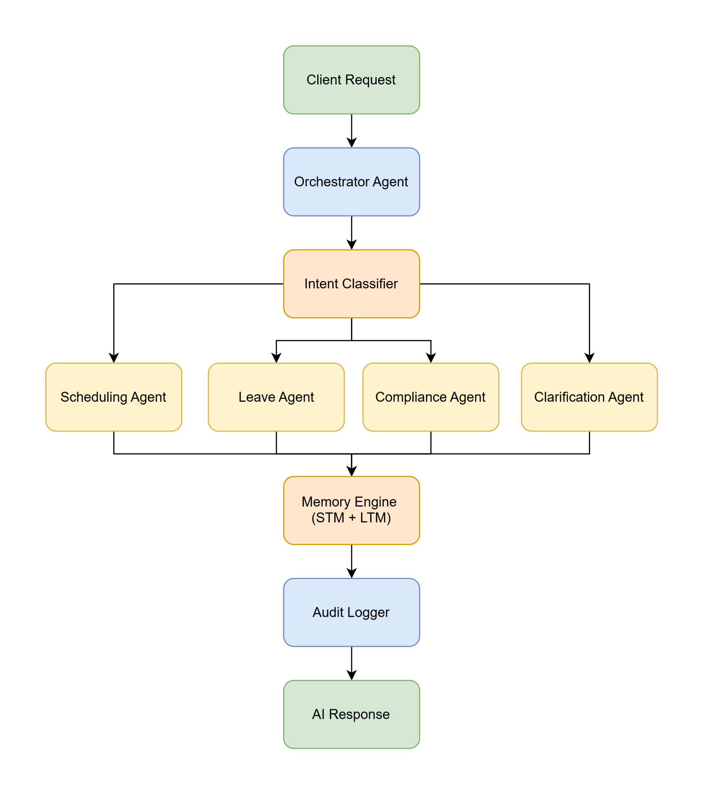

# Multi-Agent HR Automation Engine

An AI-powered multi-agent orchestration platform for HR workflow automation using FastAPI, LangGraph, and LLM-based
intent routing.

---

# Overview

This project implements a centralized Orchestrator Agent that receives natural language HR requests and routes them to
specialized sub-agents such as:

- Scheduling Agent
- Leave Management Agent
- Compliance Agent
- Clarification Agent

The system supports contextual memory retrieval, audit logging, intent classification, and intelligent task
orchestration.

---

# Features

## AI Orchestration

- Central Orchestrator Agent
- Intent classification with confidence scoring
- Dynamic routing to specialist sub-agents
- Context-aware prompt injection

## Memory System

### Short-Term Memory (STM)

- Stores recent conversation context
- Session-aware retrieval

### Long-Term Memory (LTM)

- Stores historical interactions
- Persistent contextual memory

## REST API

### Request Handling

- Submit natural language HR requests

### Memory Management

- Retrieve/update memory records

### Audit Retrieval

- Access append-only audit logs

### Health Monitoring

- Service status endpoints

## Audit Logging

- Append-only audit trail
- Tracks:
    - Requests
    - Intent decisions
    - Agent routing
    - Responses
    - Memory retrievals

---

# Tech Stack

| Layer              | Technology                |
|--------------------|---------------------------|
| Backend            | Python 3.11+              |
| API Framework      | FastAPI                   |
| Agent Workflow     | LangGraph                 |
| Database           | SQLite                    |
| LLM Integration    | OpenAI / Open-source LLMs |
| Environment Config | python-dotenv             |

---

# System Architecture



---

# Project Structure

```
```

---

# Installation

## Clone Repository

```bash
git clone https://github.com/InzamanCareem/Automated-HR-AI-System.git
cd Automated-HR-AI-System
```

## Create Virtual Environment

```bash
uv venv venv
```

## Activate Environment

### Windows

```bash
.\venv\Scripts\activate.bat
```

### Linux/Mac

```bash
source venv/bin/activate
```

## Install Dependencies

```bash
uv sync
```

## Environment Variables

Create a ```.env``` file:

Running the Application

Server: http://127.0.0.1:8000


---

# Future Improvements

- Docker support
- PostgreSQL integration
- Vector database memory
- JWT authentication
- Kubernetes deployment
- LangSmith observability
- Multi-tenant architecture
- Streaming responses
- Redis caching

---

# Use Cases

- HR automation platforms
- Enterprise AI assistants
- Employee self-service systems
- AI workflow orchestration
- Multi-agent experimentation

---

# License

MIT License